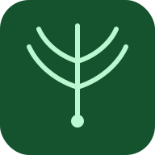

<p align="center">
  
</p>

<h1 align="center">Understoria</h1>

<p align="center">
  <strong>Grow power from below.</strong><br>
  A federated, encrypted mutual aid timebank for organizing communities.
</p>

<p align="center">
  <a href="#project-status">Project Status</a> •
  <a href="#what-it-does">What It Does</a> •
  <a href="#why-it-exists">Why It Exists</a> •
  <a href="#quick-start">Quick Start</a> •
  <a href="#architecture">Architecture</a> •
  <a href="#contributing">Contributing</a> •
  <a href="#community">Community</a> •
  <a href="#license">License</a>
</p>

<p align="center">
  
  
  
</p>

---

## Project Status

> **Understoria is beta software, and much of its code was written with AI
> tools and reviewed by people.** It has not yet had an independent security
> audit. The protections it ships — end-to-end encrypted messages, signed
> records, the emergency wipe — are real and covered by tests, but beta means
> bugs are possible, including ones we haven't found.
>
> It's built for coordinating everyday neighborly help. Please don't put
> anything in it that would hurt you or someone else if it leaked —
> government IDs, medical or immigration details, or anything you'd only say
> off the record. This caution is also disclosed inside the app itself (on
> the welcome tour, the invite screen, and in Help and Settings).
>
> Per the [AGPL-3.0-or-later license](LICENSE), the software is provided
> **without warranty of any kind**.

## What It Does

Understoria is a platform where communities exchange help, tracked through **time credits**. One hour of help equals one hour of help — regardless of the type of work. No market pricing, no hierarchy, no algorithms deciding who gets support.

**Post what you need. Offer what you can. Build collective power.**

- **Community Board** — Post needs and offers across categories like transport, food, childcare, skilled labor, emotional support, education, and more. Descriptions and comments render a safe Markdown subset (bold, lists, links, tables) with no HTML injection path by construction.
- **Community Projects** — Collective efforts with task lists, starter templates, co-organizer invitations, task ordering and soft dependencies, and a page per task for its discussion thread. The **In my care** tab (`/my-work`) gathers every task you're carrying, shift you've signed up for, need you've claimed, and project in your care, across projects.
- **Timebank Credits** — Every exchange earns and spends time credits. New members start with seed credits so asking for help is never gated. Project-task credit records the hours actually given, not the estimate.
- **Collective Dashboard** — See your community's total hours exchanged, active members, solidarity streaks, and milestones. The unit of progress is *us*, not *me*.
- **Community Calendar** — Project deadlines, post expiries, and federated events (skillshares, potlucks, work days) in one agenda / month / week view, with event templates for common gatherings and a per-event "Add to calendar" `.ics` export (client-side only — no subscription URLs, ever). RSVPs stay on the node where they happen; nothing federates a member-attendance graph.
- **Member Blocking** — A local-only personal-relief surface for stopping unwanted contact, parallel to (and independent of) the community dispute process. Blocks never federate, never aggregate, never signal anything to the blocked party.
- **Invite-only mode** — Operators can flip the node from open-onboarding to invite-only at any time; the existing signed-invite redemption path stays the only way in.
- **Achievements as Roles** — Earn community roles like Connector, Bridge Builder, and Listener — recognition without ranking.
- **End-to-End Encryption** — Key-pair identity, signed transactions, encrypted messaging. No email or phone number required.
- **Federation** — Each community runs its own node. Nodes can peer with each other to share needs and offers across groups. No central server, no single point of failure.
- **Organizing Tools** *(planned)* — Campaign trackers, one-on-one conversation logs, power mapping, and meeting facilitation — connecting mutual aid to collective action. The Organizing Integration module is a future workstream (Agent 7 on the roadmap).

## Why It Exists

Mutual aid networks are powerful, but they're often held together by spreadsheets, group chats, and the sheer willpower of a few overworked organizers. Understoria gives communities a dedicated tool that's designed for solidarity — not engagement metrics, not ad revenue, not data extraction.

The software is built around a few core beliefs:

- **All labor has equal value.** Emotional support counts as much as plumbing.
- **Asking for help should never be gated.** Seed credits mean you can receive before you give.
- **Collective progress matters more than individual scores.** The dashboard celebrates the community, not the top contributors.
- **Privacy is a precondition for organizing.** Workers face real retaliation. The platform protects membership lists, communication patterns, and activity history.
- **Communities should own their infrastructure.** Federated, self-hosted, open source, cooperatively governed.

## Quick Start

### Run locally (development)

Requires Node 20+. On a fresh Debian/Ubuntu host you may also need
`build-essential` and `python3` so the optional community-node
workspace can compile its native SQLite binding — see
[Operator Guide §3](docs/operator-guide.md#3-build-from-source) for
the apt-get one-liner.

```bash
# Clone the repo
git clone https://github.com/ardentcascades/understoria.git
cd understoria

# Install dependencies
npm install

# Start the PWA dev server (port 5173)
npm run dev
```

The PWA runs at `http://localhost:5173`. No backend required for the
PWA itself — every member's data lives in their browser's IndexedDB.

To also run the optional community node (Fastify + SQLite, port 8787):

```bash
# In a separate terminal
npm run dev:server
```

Then in the PWA, **Profile → Settings (gear icon) → Community
node** → paste `http://localhost:8787` and tick "Mirror finalized
exchanges to this node." Finalized exchanges mirror to the node and the outbox status
chip shows delivery progress.

`npm test` runs the full vitest suite across all workspaces.
`npm run build` produces the PWA static bundle that a community node
serves.

### Deploy a community node

Two paths, both supported:

- **PWA-only** — serve the built `dist/` over HTTPS from any static
  host. Members' data stays on their devices.
- **PWA + Fastify node** — run the multi-stage Dockerfile via
  `docker compose up -d` from the repo root. Adds a community-wide
  ledger of signed exchanges; the foundation for federation.

A Caddy reverse-proxy config, VPS notes, Raspberry Pi walk-through,
and full env-var reference are in the
[Node Operator Guide](docs/operator-guide.md).

### Other ways in

- **Linux desktop app (AppImage)** — the same member app in one
  carryable file, no installed browser required. Because it loads
  from local disk it can join a node that has never been online —
  a laptop-sized dent in the born-offline gap. Built by CI on every
  change; design and security posture in
  [docs/desktop-appimage.md](docs/desktop-appimage.md).
- **Install from a flash drive** — `scripts/make-flash-drive.sh`
  packs images, source, docs, and (optionally) the node's sealed
  keys onto a USB drive; `START-HERE.sh` on the drive provisions or
  restores a node with no internet at install time. Runbook:
  [docs/flash-drive-install.md](docs/flash-drive-install.md).

The Node.js community server is shipped: signed-record ingestion
with verification, the federation pull loop between peer nodes,
and Docker deployment (see the operator guide above and
[deploy-linode.md](docs/deploy-linode.md) for the full runbook).
Prefer rootless Podman, bare metal + systemd, or a proxy other than
Caddy? See [deploy-alternatives.md](docs/deploy-alternatives.md).
Every deployed node also serves its own source code at `/source/`
(AGPL §13 with no third-party dependency — operator guide §7a), so
communities can inspect, mirror, and bootstrap from each other even
if this repository's host disappears — the step-by-step walkthrough
is [bootstrap-from-a-node.md](docs/bootstrap-from-a-node.md).

## Architecture

```
┌──────────────────────────────────────────────────┐
│                    Client (PWA)                   │
│  React + TypeScript + Tailwind + IndexedDB        │
│  Offline-first, installable, works on cheap phones│
└──────────────────┬───────────────────────────────┘
                   │
                   │ REST API + E2E Encrypted Messages
                   │
┌──────────────────▼───────────────────────────────┐
│                 Community Node                    │
│  Node.js + SQLite/SQLCipher                       │
│  Self-hosted, Docker-deployable                   │
└──────────┬───────────────────────┬───────────────┘
           │                       │
           │ Federation Protocol   │
           │                       │
┌──────────▼──────┐    ┌──────────▼──────┐
│   Peer Node A   │    │   Peer Node B   │
│   (Neighborhood │    │   (Workplace    │
│    mutual aid)  │    │    organizing)  │
└─────────────────┘    └─────────────────┘
```

### Key Design Decisions

- **Identity** — Ed25519 key pairs. No email, no phone number, no external identity provider. Your public key is your identity.
- **Trust** — Web-of-trust vouching. New members need two vouches from existing members. Mirrors how real organizing works.
- **Transactions** — Every exchange is signed by both parties. Verifiable by any node without a central authority.
- **Data** — Encrypted at rest (SQLCipher). Minimal logging. The app server stores no IP addresses (rate limiting only ever hashes them); the one exception is the reverse proxy's rotating access log, which operators keep short-lived — see the privacy policy §5. Panic button for emergency data purge.
- **Federation** — Nodes peer voluntarily. Shared needs/offers broadcast across the network. Cross-node exchanges recorded on both sides.
- **Sync** — CRDT-based data model. Nodes operate independently when disconnected, reconcile when reconnected.

### Tech Stack

| Layer | Technology |
|-------|-----------|
| Frontend | React, TypeScript, Tailwind CSS, Workbox (PWA) |
| Local Storage | IndexedDB (Dexie.js) |
| Backend | Node.js (Fastify) |
| Database | SQLite + SQLCipher |
| Crypto | tweetnacl / libsodium.js (Ed25519, X25519, XSalsa20-Poly1305) |
| Federation | ActivityPub-inspired protocol, CRDTs |
| Deployment | Docker, single-command deploy |

## Project Structure

```
understoria/
├── apps/
│   ├── web/                 # React PWA (main client)
│   └── server/              # Node.js community server
├── packages/
│   └── shared/              # Shared types, crypto (signing,
│                            #   E2E encryption), canonical payloads
├── docs/
│   ├── member-guide.md      # How to use the app
│   ├── operator-guide.md    # How to deploy a node
│   ├── organizer-guide.md   # How to introduce to a group
│   ├── threat-model.md      # Security analysis
│   └── political-education/ # History of mutual aid + timebanking
├── docker-compose.yml
├── LICENSE                  # AGPL-3.0-or-later
└── README.md
```

## Documentation

| For | Read |
|-----|------|
| First-time setup on a Debian / Ubuntu VM | [Quickstart](docs/quickstart.md) |
| Members using the app | [Member Guide](docs/member-guide.md) |
| People introducing the app to a group | [Organizer's Guide](docs/organizer-guide.md) |
| Operators deploying a node | [Node Operator Guide](docs/operator-guide.md) |
| Deploying without Docker (Podman, systemd, nginx…) | [Deploy Alternatives](docs/deploy-alternatives.md) |
| Anyone — staying safe while using Understoria | [Opsec Guide](docs/opsec-guide.md) |
| Developers and contributors | [Developer Guide](docs/developer-guide.md), [Contributing](CONTRIBUTING.md) |
| Understanding the security posture | [Threat Model](docs/threat-model.md) |
| Governance and decision-making | [Governance](GOVERNANCE.md), [Code of Conduct](CODE_OF_CONDUCT.md) |
| Where the work is heading | [Roadmap](docs/roadmap.md) |
| Study groups and political grounding | [Political Education](docs/political-education/) |
| Trademark and brand use | [Trademark Policy](TRADEMARK.md) |

## Contributing

Understoria is built by and for organizing communities. Contributions
are welcome from anyone who shares the project's values. Start with
[CONTRIBUTING.md](CONTRIBUTING.md) and the
[Developer Guide](docs/developer-guide.md).

All contributions are made under the
[Developer Certificate of Origin (DCO)](https://developercertificate.org/).
Sign off every commit with `git commit -s`.

### Areas where help is needed

- **Frontend development** — React, TypeScript, accessibility, responsive design
- **Cryptography review** — Audit the identity and encryption implementations
- **Federation protocol** — Design and test node-to-node communication (Agent 3)
- **Documentation** — Guides, tutorials, and translations (especially Spanish)
- **Community testing** — If you're part of a mutual aid network or organizing group and want to pilot Understoria, we want to hear from you
- **Design** — UI/UX, illustrations, iconography that signals solidarity without being cheesy

## Community

- **Discussions** — [GitHub Discussions](https://github.com/ardentcascades/understoria/discussions) for questions, ideas, and conversation
- **Issues** — [GitHub Issues](https://github.com/ardentcascades/understoria/issues) for bugs and feature requests
- **Matrix** — `#understoria:matrix.org` for real-time chat (encrypted by default)

We make decisions through modified consensus. Major decisions go through a community proposal process. See [GOVERNANCE.md](GOVERNANCE.md) for details.

## Roadmap

The full agent-by-agent decomposition, including ordering rationale
and open design questions, lives in [`docs/roadmap.md`](docs/roadmap.md).
The phase view below is a public summary.

### Phase 1: Foundations
- [x] Project plan and architecture
- [x] Core PWA with community board, exchange flow, and credits
- [x] Threat model and security hardening plan
- [x] Code of Conduct and governance draft
- [ ] Paper prototype testing with pilot communities

### Phase 2: Hardening *(active)*
- [x] Ed25519 key-pair identity and signed exchange transactions
- [x] Cryptographic invites + web-of-trust vouching
- [x] Passphrase-wrapped private keys
- [x] Panic button (soft + hard purge)
- [x] Anti-gaming safeguards
- [x] Milestones, achievements, solidarity streaks
- [x] Member guide and operator guide drafts
- [x] End-to-end encrypted messaging
- [x] Device pairing — same-identity transfer to a second device via local QR + one-time passphrase, with fingerprint verification and a paired-device inventory on Profile
- [x] Community calendar — agenda / month / week view aggregating project deadlines, post expiries, and exchange density (5th bottom-nav tab)
- [x] Community events — federated signed `Event` + `EventCancellation` records, RSVPs as signed records that sync through your own community's node (never relayed to peers), comparison-card create flow, attention-rail integration, and an "Events only" calendar filter
- [x] Member blocking — local-only personal-relief surface with informed-consent comparison card, per-block governance-visibility toggle, paired-device transfer, and tap-to-reveal Settings panel
- [x] Invite-only mode — `nodeConfig.inviteOnly` flag with first-member bootstrap exception for fresh deployments
- [x] Task ordering + soft-block dependencies — drag / Move buttons / Reorder modal for organisers; `Follows:` framing + claimant ack line + chip suppression for structurally-blocked tasks; ordering and dependencies ride the signed `TaskState` records, so they sync between members' devices like the rest of the task row

### Phase 3: Federation *(active)*
- [x] Community node server with Docker deployment
- [x] Signed-exchange verification on the server
- [x] Spanish translation
- [x] Federation protocol and cross-node exchanges (server endpoints, pull loop, PWA surfacing done; full lifecycle sync pending)
- [x] Posts / vouches / redemption-receipt endpoints on the server (the earlier invites endpoint was deliberately removed — open invites never cross any wire; redemption receipts replaced it)
- [x] Per-task comment threads + federation (signed, tombstone-merge soft delete) + community flag-for-review via the existing disputes surface
- [ ] Organizing module: campaigns, power mapping, meeting tools

### Phase 4: Launch
- [ ] Pilot deployment with 3 communities
- [ ] Workshop curriculum and training sessions
- [ ] v1.0 release

### Phase 5: Commons governance *(planned)*

Staged additions based on Elinor Ostrom's design principles for
governing the commons, plus standalone additions drawn from the
Kerala model and the potlatch tradition. See
[`docs/roadmap.md`](docs/roadmap.md#agents-11--15-ostrom-commons-extension)
for the full breakdown, the items that were absorbed into existing
agents, and the items that are deferred behind explicit gates.

- [x] Per-node configuration + operator transparency (Agent 11)
- [x] In-app onboarding & political literacy (Agent 16)
- [x] Breadth & reciprocity Dashboard additions (Agent 18a)
- [x] Shared "Decisions" surface for proposals, disputes, and recall (Agents 13 + 14, with reversibility tiers folded in)
- [ ] Moderation queue and graduated sanctions (Agent 12)
- [ ] Per-peer federation agreements (Agent 15)

Phase 5 does not block Phase 4 — a v1.0 pilot can ship with Agents 11 and 16 only.

## Ethical Use

Understoria was built for mutual aid, labor organizing, and community solidarity. It is specifically designed to protect the people who use it from surveillance and retaliation.

Using this software to surveil workers, facilitate union-busting, harvest personal data for commercial purposes, or undermine the organizing efforts of any community violates the spirit of this project.

While the AGPL license grants broad usage rights, we ask that anyone who deploys Understoria honor the values it was built to serve.

## Acknowledgments

Understoria stands on the shoulders of movements and thinkers who came before: from Peter Kropotkin's *Mutual Aid* to the Black Panther Party's survival programs, from Edgar Cahn's timebanking work to the countless mutual aid networks that emerged during the COVID-19 pandemic. This software is a small contribution to a very old tradition.

We also owe a debt to the open-source projects that make this possible: [Matrix](https://matrix.org), [Mastodon](https://joinmastodon.org), [Signal](https://signal.org), [Automerge](https://automerge.org), and many others.

## License

Understoria is licensed under the [GNU Affero General Public License v3.0 or later](LICENSE).

This means you are free to use, modify, and distribute this software, provided that any modified versions you run as a network service are also made available under the same license. This ensures the code remains open and community-owned.

The name "Understoria" and associated logos are trademarks of the Understoria Cooperative. You may fork the code freely, but use of the name and branding requires permission. See [TRADEMARK.md](TRADEMARK.md) for details.

---

<p align="center">
  <em>Built with solidarity, not surveillance.</em><br>
  <em>One hour of help = one hour of help.</em>
</p>
