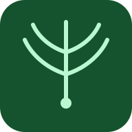
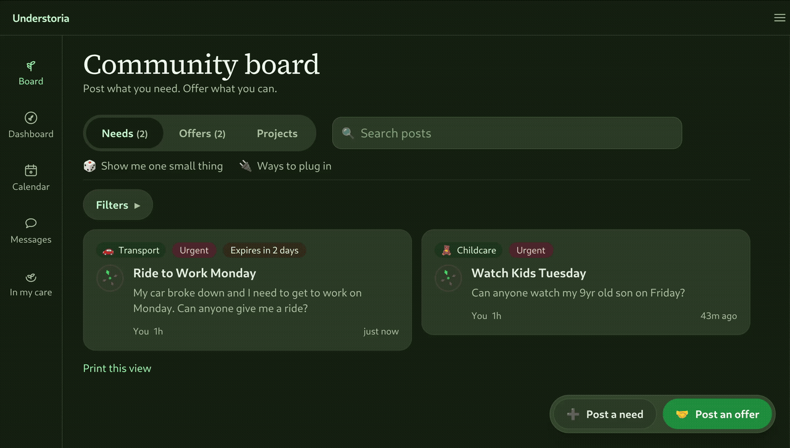
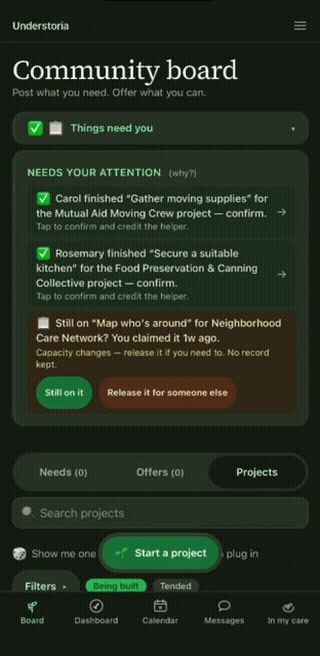
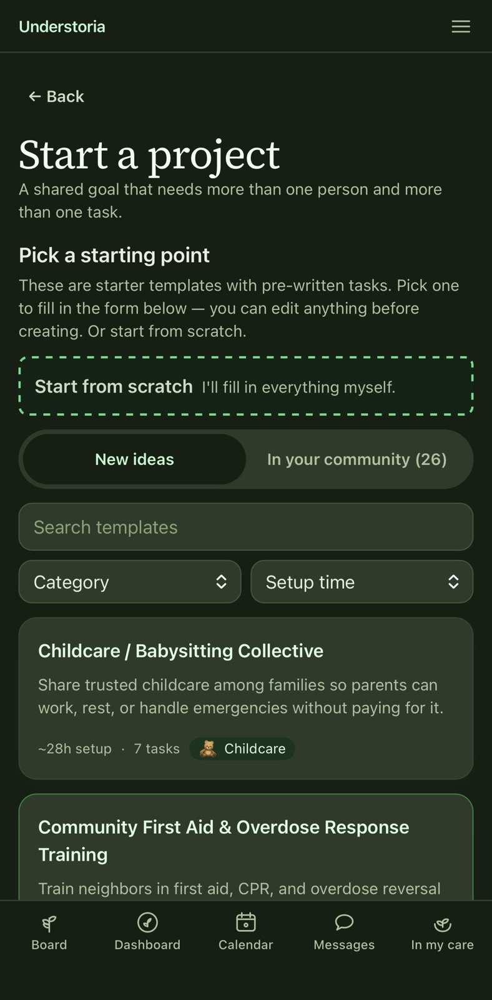
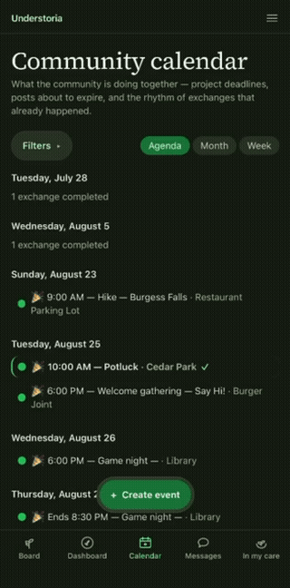
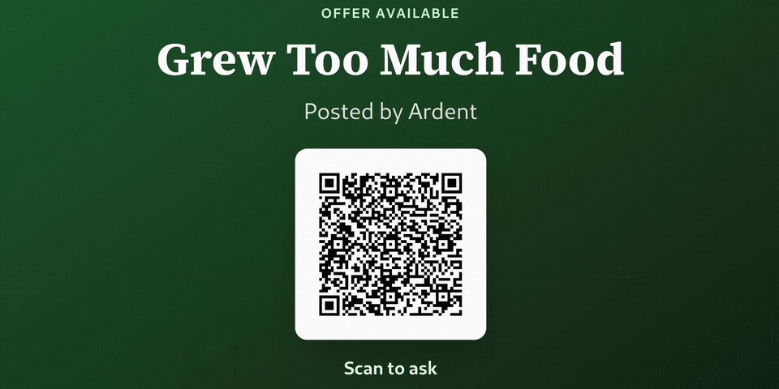

<p align="center">
  
</p>

<h1 align="center">Understoria</h1>

<p align="center">
  <strong>Grow power from below.</strong><br>
  A federated, encrypted mutual aid timebank for organizing communities.
</p>

<p align="center">
  <a href="#project-status">Project Status</a> •
  <a href="#start-here">Start Here</a> •
  <a href="#what-it-does">What It Does</a> •
  <a href="#what-protects-you">What Protects You</a> •
  <a href="#why-nothing-buzzes">Why Nothing Buzzes</a> •
  <a href="#why-it-exists">Why It Exists</a> •
  <a href="#run-it-yourself">Run It Yourself</a> •
  <a href="#architecture">Architecture</a> •
  <a href="#contributing">Contributing</a> •
  <a href="#community">Community</a> •
  <a href="#license">License</a>
</p>

<p align="center">
  
  
  
</p>

<p align="center">
  
</p>

---

## Project Status

> **Understoria is beta software, and much of its code was written with AI
> tools and reviewed by people.** It has not yet had an independent security
> audit. The protections it ships — end-to-end encrypted messages, signed
> records, the emergency wipe — are real and covered by tests, but beta means
> bugs are possible, including ones we haven't found.
>
> It's built for coordinating everyday neighborly help. Please don't put
> anything in it that would hurt you or someone else if it leaked —
> government IDs, medical or immigration details, or anything you'd only say
> off the record. This caution is also disclosed inside the app itself (on
> the welcome tour, the invite screen, and in Help and Settings).
>
> Per the [AGPL-3.0-or-later license](LICENSE), the software is provided
> **without warranty of any kind**.

<!-- The router. Three audiences, one file, because GitHub renders one
     README: an organizer README that is not README.md goes unread.
     Keep these three rows in this order — an organizer is the reader
     the tagline claims, and used to reach `git clone` before anything
     addressed to them (docs/readme-plan.md). -->

## Start here

| If you are… | Go to |
|---|---|
| **Running a mutual aid group** and wondering whether this fits — or how to introduce it without wrecking the trust you already have | [Organizer's Guide](docs/organizer-guide.md) |
| **Hosting a node** for a community | [Node Operator Guide](docs/operator-guide.md), or [Quickstart](docs/quickstart.md) for a first VM |
| **Writing code**, reviewing the crypto, or translating | [Developer Guide](docs/developer-guide.md) and [CONTRIBUTING.md](CONTRIBUTING.md) |

Already a member of a community that uses Understoria? The
[Member Guide](docs/member-guide.md) is the one for you, and the app
itself has a Help tab that says the same things.

## What It Does

Understoria is a platform where communities exchange help, tracked through **time credits**. One hour of help equals one hour of help — regardless of the type of work. No market pricing, no hierarchy, no algorithms deciding who gets support.

**Post what you need. Offer what you can. Build collective power.**

<!-- Grouped by the question an organizer is actually asking —
     what members do with it, what holds the group together, what it
     takes to run. Twelve equal-weight bullets answered none of those
     in order (docs/readme-plan.md R3). -->

### What people do with it

- **Community Board** — Post needs and offers across categories like transport, food, childcare, skilled labor, emotional support, education, and more.
- **Community Projects** — Collective efforts with task lists, starter templates, co-organizer invitations, task ordering and soft dependencies, and a page per task for its discussion thread. The **In my care** tab (`/my-work`) gathers every task you're carrying, shift you've signed up for, need you've claimed, and project in your care, across projects.
- **Timebank Credits** — Every exchange earns and spends time credits. New members start with seed credits so asking for help is never gated. Project-task credit records the hours actually given, not the estimate.

### What holds a group together

- **Community Calendar** — Project deadlines, post expiries, and federated events (skillshares, potlucks, work days) in one agenda / month / week view, with event templates for common gatherings and a per-event "Add to calendar" `.ics` export.
- **Collective Dashboard** — See your community's total hours exchanged, active members, solidarity streaks, and milestones. The unit of progress is *us*, not *me*.
- **Gathering Screen** — A fullscreen display for a shared screen in the room: a TV in the corner of a repair café, a laptop propped on a table at a skillshare. It rotates through upcoming events, claimable tasks, and open needs and offers, and puts a QR code on every slide so anyone present can RSVP, claim the task, or message whoever posted — from their own phone, in one scan.
- **Achievements as Roles** — Earn community roles like Connector, Bridge
  Builder and Listener. These are not scores and there is no leaderboard:
  `no-leaderboards` is one of the twelve named design principles the app
  holds itself to, and tapping "why" on a surface that could have shown a
  ranking explains what happened to the platforms that did.
- **Member Blocking** — A local-only personal-relief surface for stopping unwanted contact, parallel to (and independent of) the community dispute process.
- **The attention rail** — Open the app and the top of the board says what
  needs you: a task someone finished and is waiting on you to confirm, a
  thing you claimed a while back that you can quietly hand back. It is what
  the app does instead of notifying you — see
  [Why nothing buzzes](#why-nothing-buzzes) for what that buys and what it
  costs. Releasing something you can no longer carry leaves no record.

<p align="center">
  
</p>

<p align="center">
  <em>What needs you, when you open the app. The "why?" beside the heading
  explains why nothing buzzed to get you here.</em>
</p>


### Who can join, and who runs it

- **Invite-only mode** — Operators can flip the node from open-onboarding to invite-only at any time; the existing signed-invite redemption path stays the only way in.
<!-- Eight languages: apps/web/src/i18n/languages.ts (LANGUAGES).
     Six carry reviewStatus: "new". Guarded by
     apps/web/src/lib/readme.guard.test.ts — update both together. -->
- **Eight languages** — English, Spanish, French, Portuguese, Chinese, Hindi,
  Vietnamese and Russian, each with the whole authored corpus translated, not
  just the buttons: the help pages, the project playbooks, the event
  templates. Six are newly translated and have not yet been read by a native
  speaker — the app says so in Settings rather than pretending otherwise.
- **Federation** — Each community runs its own node. Nodes can peer with each other to share needs and offers across groups. No central server, no single point of failure.

### Not built yet

- **Organizing Tools** *(planned)* — Campaign trackers, one-on-one conversation logs, power mapping, and meeting facilitation — connecting mutual aid to collective action. Not built yet; it is a named workstream on the [roadmap](docs/roadmap.md).

<p align="center">
  
</p>

<p align="center">
  <em>Starting a project from one of 64 playbooks — each arrives with its own
  task list, hour estimates and suggested first steps, so nobody begins at an
  empty page.</em>
</p>

## What protects you

<!-- These facts were each buried at the end of a feature bullet, where
     they read as jargon rather than as the reassurance they are. One
     copy only — the technical statement of the same posture lives in
     docs/threat-model.md, which this points at rather than repeats. -->

"Privacy is a precondition for organizing" is one of the beliefs below,
and workers face real retaliation. These are the specific things the
software does about it, in plain terms:

- **No email, no phone number, no account with anyone.** Your identity
  is a key pair generated on your device. There is nothing to hand over
  because there is nothing collected.
- **Messages are end-to-end encrypted,** and every exchange is signed by
  both parties, so a record can be verified without trusting the server
  that stored it.
- **The node keeps no IP addresses.** Rate limiting only ever hashes
  them. The one exception is the reverse proxy's own rotating access
  log, which operators are told to keep short-lived.
- **No attendance graph, anywhere.** RSVPs stay on the node where they
  happen and are never relayed to peer nodes. Who showed up to what is
  not a thing this software assembles.
- **Blocking is yours alone.** Blocks never federate, never aggregate,
  and never signal anything to the person blocked.
- **The screen in the room can't leak.** The gathering screen is
  read-only and shows only what is already public — it never changes
  anything and never displays private data.
- **Member-authored text cannot inject anything.** Descriptions and
  comments render a safe Markdown subset — bold, lists, links, tables —
  with no HTML path by construction.
- **Data is encrypted at rest** (SQLCipher), and there is a panic button
  for emergency purge, soft or hard.

None of this has had an independent security audit yet — see Project
Status above. The full analysis, including what is *not* protected, is
in the [Threat Model](docs/threat-model.md).

## Why nothing buzzes

<!-- The honest version. Enforced by apps/web/src/lib/noNotifications.guard.test.ts,
     which fails if a Notification/push/badge/vibrate call site or a push
     dependency appears. The costs below are real and were found by
     auditing the code, not by asking the code to agree with us. -->

Most software of this kind reaches for your phone. Understoria doesn't,
and that is the single biggest way it departs from what you are used to.
It's worth being precise about what that means, because the polite
version would be marketing.

**What it does instead.** The top of the board is a rail listing what
actually needs you — someone finished work and is waiting on you to
confirm it, a thing you claimed a while ago and might want to hand back.
It has no count badge on it, deliberately; the code says so at the spot
where a badge would have gone. You see it when you open the app, and
that is the only time you see it.

**Why.** The project's bet is that notification-driven tools burn out
the most committed organizers first — the people a community can least
afford to lose — and that a badge is a claim on your attention that you
never agreed to. That is a belief this project holds, not a finding it
can cite; the principle behind it is `no-notifications`, and you can read
it in the app, on the surfaces where a notification would otherwise have
been.

**What it does not mean.** The app does hold an open connection to your
community's node while you're using it. That connection carries no
record, no sender and no subject — it is a content-free "something
changed" tap that makes the screen you're already looking at refresh.
There are no push notifications; there is server push. Those are
different sentences, and the second one is also true.

### What it costs

Four things, plainly, because an organizer deciding whether to trust
this deserves them before they find out the hard way.

**It is not a rapid-response tool.** How fast someone learns about
something is exactly how soon they next open the app, which for a
quieter member can be days. If your community needs to reach people
within hours — an eviction defence, a raid response, a shift that just
lost its only cover — keep the phone tree and the group thread.
Understoria is the layer underneath that, not the alarm.

**Screen-reader users are announced to.** The rail is a live region, so
a new item arriving while the app is open is spoken. "You only see it
when you open the app" is a sighted person's description of this
software; for someone using assistive technology, items arrive.

**Silence eventually gets resolved without you.** When someone marks
work complete and you never confirm it, the node closes the record on
its own after a window your community sets — seven days by default —
and the credit moves. Nothing is lost while you're away in part because
your chance to say *that didn't happen* has a deadline.

**Absence can become visible.** A task you claimed and went quiet on
will, after a while, show the community that it *could use more hands*.
It is never framed as late and it never names you as the reason. It is
still a mark that your absence made, and you were not asked first.

None of these are arguments for adding notifications. They are the price
of not having them, and a community should get to weigh it knowingly.

## Why It Exists

Mutual aid networks are powerful, but they're often held together by spreadsheets, group chats, and the sheer willpower of a few overworked organizers. Understoria gives communities a dedicated tool that's designed for solidarity — not engagement metrics, not ad revenue, not data extraction.

<p align="center">
  
</p>

<p align="center">
  <em>Agenda, month, week. Potlucks, hikes, welcome gatherings, game nights —
  the shared occasions that turn a list of neighbours into people who know each
  other.</em>
</p>

The software is built around a few core beliefs:

- **All labor has equal value.** Emotional support counts as much as plumbing.
- **Asking for help should never be gated.** Seed credits mean you can receive before you give.
- **Collective progress matters more than individual scores.** The dashboard celebrates the community, not the top contributors.
- **Privacy is a precondition for organizing.** Workers face real retaliation. The platform protects membership lists, communication patterns, and activity history.
- **Communities should own their infrastructure.** Federated, self-hosted, open source, cooperatively governed.

<!-- Twelve principles: apps/web/src/content/design-principles.ts.
     The five beliefs above are the prose version of five of them.
     Guarded by apps/web/src/lib/readme.guard.test.ts — if the count
     changes, change it here too. -->

Those five are the prose version of something more specific. The app
holds itself to **twelve named design principles** — `equal-time`,
`no-leaderboards`, `no-notifications`, `solidarity-not-shame`,
`asking-never-gated`, `privacy-precondition` and six more — each with a
statement and a piece of history behind it. They are not a manifesto
filed somewhere. Thirty-one screens carry a **"why"** control, and where
a surface could plausibly have shown a score, a ranking or a read
receipt, tapping it tells the member what happened to the platforms that
did. The `no-leaderboards` entry, for
instance, cites Couchsurfing's reputation score and who it froze out.

They live in
[`apps/web/src/content/design-principles.ts`](apps/web/src/content/design-principles.ts),
which is where to change them — the list above is prose, that file is
the source of truth.

<p align="center">
  
</p>

<p align="center">
  <em>Understoria's members are often in the same room. The gathering screen is
  built for that: a TV in the corner, and every slide one thing someone present
  can do, with the QR code to do it.</em>
</p>

## Run it yourself

> For developers and node operators. If you are deciding whether to
> bring Understoria to a community, the [Organizer's
> Guide](docs/organizer-guide.md) is the better door — you do not need
> to run any of this to make that decision.

### Run locally (development)

Requires Node 20+. On a fresh Debian/Ubuntu host you may also need
`build-essential` and `python3` so the optional community-node
workspace can compile its native SQLite binding — see
[Operator Guide §3](docs/operator-guide.md#3-build-from-source) for
the apt-get one-liner.

```bash
# Clone the repo
git clone https://github.com/ardentcascades/understoria.git
cd understoria

# Install dependencies
npm install

# Start the PWA dev server (port 5173)
npm run dev
```

The PWA runs at `http://localhost:5173`. No backend required for the
PWA itself — every member's data lives in their browser's IndexedDB.

To also run the optional community node (Fastify + SQLite, port 8787):

```bash
# In a separate terminal
npm run dev:server
```

Then in the PWA, **Profile → Settings (gear icon) → Community
node** → paste `http://localhost:8787` and tick "Mirror finalized
exchanges to this node." Finalized exchanges mirror to the node and the outbox status
chip shows delivery progress.

`npm test` runs the full vitest suite across all workspaces.
`npm run build` produces the PWA static bundle that a community node
serves.

### Deploy a community node

Two paths, both supported:

- **PWA-only** — serve the built `dist/` over HTTPS from any static
  host. Members' data stays on their devices.
- **PWA + Fastify node** — run the multi-stage Dockerfile via
  `docker compose up -d` from the repo root. Adds a community-wide
  ledger of signed exchanges; the foundation for federation.

A Caddy reverse-proxy config, VPS notes, Raspberry Pi walk-through,
and full env-var reference are in the
[Node Operator Guide](docs/operator-guide.md).

### Other ways in

Understoria also ships as a **Linux desktop AppImage** (one carryable
file, no browser required, able to join a node that has never been
online) and can be **installed from a flash drive** with no internet at
install time. Both have their own runbooks:
[desktop-appimage.md](docs/desktop-appimage.md) and
[flash-drive-install.md](docs/flash-drive-install.md).

Every deployed node serves its own source at `/source/` (AGPL §13, no
third-party dependency), so communities can inspect, mirror and bootstrap
from each other even if this repository's host disappears —
[bootstrap-from-a-node.md](docs/bootstrap-from-a-node.md) walks it
through. Deploying without Docker is covered in
[deploy-alternatives.md](docs/deploy-alternatives.md).

## Architecture

```
┌──────────────────────────────────────────────────┐
│                    Client (PWA)                   │
│  React + TypeScript + Tailwind + IndexedDB        │
│  Offline-first, installable, works on cheap phones│
└──────────────────┬───────────────────────────────┘
                   │
                   │ REST API + E2E Encrypted Messages
                   │
┌──────────────────▼───────────────────────────────┐
│                 Community Node                    │
│  Node.js + SQLite/SQLCipher                       │
│  Self-hosted, Docker-deployable                   │
└──────────┬───────────────────────┬───────────────┘
           │                       │
           │ Federation Protocol   │
           │                       │
┌──────────▼──────┐    ┌──────────▼──────┐
│   Peer Node A   │    │   Peer Node B   │
│   (Neighborhood │    │   (Workplace    │
│    mutual aid)  │    │    organizing)  │
└─────────────────┘    └─────────────────┘
```

### Key Design Decisions

- **Identity** — Ed25519 key pairs. No email, no phone number, no external identity provider. Your public key is your identity.
- **Trust** — Web-of-trust vouching. New members need two vouches from existing members. Mirrors how real organizing works.
- **Transactions** — Every exchange is signed by both parties. Verifiable by any node without a central authority.
- **Data** — Encrypted at rest (SQLCipher), minimal logging, no stored IP
  addresses. Stated plainly under [What protects you](#what-protects-you);
  the reverse-proxy log exception is privacy policy §5.
- **Federation** — Nodes peer voluntarily. Shared needs/offers broadcast across the network. Cross-node exchanges recorded on both sides.
- **Sync** — CRDT-based data model. Nodes operate independently when disconnected, reconcile when reconnected.

### Tech stack and repository layout

Both live in the [Developer Guide](docs/developer-guide.md) — §1 Project
layout and §2 Tech stack — which is the canonical copy and stays current
with the code.

## Documentation

| For | Read |
|-----|------|
| First-time setup on a Debian / Ubuntu VM | [Quickstart](docs/quickstart.md) |
| Members using the app | [Member Guide](docs/member-guide.md) |
| People introducing the app to a group | [Organizer's Guide](docs/organizer-guide.md) |
| Operators deploying a node | [Node Operator Guide](docs/operator-guide.md) |
| Deploying without Docker (Podman, systemd, nginx…) | [Deploy Alternatives](docs/deploy-alternatives.md) |
| Anyone — staying safe while using Understoria | [Opsec Guide](docs/opsec-guide.md) |
| Developers and contributors | [Developer Guide](docs/developer-guide.md), [Contributing](CONTRIBUTING.md) |
| Understanding the security posture | [Threat Model](docs/threat-model.md) |
| Governance and decision-making | [Governance](GOVERNANCE.md), [Code of Conduct](CODE_OF_CONDUCT.md) |
| Where the work is heading | [Roadmap](docs/roadmap.md) |
| Study groups and political grounding | [Political Education](docs/political-education/) |
| Trademark and brand use | [Trademark Policy](TRADEMARK.md) |

## Contributing

Understoria is built by and for organizing communities. Contributions
are welcome from anyone who shares the project's values. Start with
[CONTRIBUTING.md](CONTRIBUTING.md) and the
[Developer Guide](docs/developer-guide.md).

All contributions are made under the
[Developer Certificate of Origin (DCO)](https://developercertificate.org/).
Sign off every commit with `git commit -s`.

### Areas where help is needed

- **Frontend development** — React, TypeScript, accessibility, responsive design
- **Cryptography review** — Audit the identity and encryption implementations
- **Federation protocol** — Design and test node-to-node communication
- **Documentation** — Guides, tutorials, and translation review. The app
  ships in eight languages; six of them have not yet been read by a native
  speaker, and that review is some of the most useful work going
- **Community testing** — If you're part of a mutual aid network or organizing group and want to pilot Understoria, we want to hear from you
- **Design** — UI/UX, illustrations, iconography that signals solidarity without being cheesy

## Community

- **Discussions** — [GitHub Discussions](https://github.com/ardentcascades/understoria/discussions) for questions, ideas, and conversation
- **Issues** — [GitHub Issues](https://github.com/ardentcascades/understoria/issues) for bugs and feature requests
- **Matrix** — `#understoria:matrix.org` for real-time chat (encrypted by default)

We make decisions through modified consensus. Major decisions go through a community proposal process. See [GOVERNANCE.md](GOVERNANCE.md) for details.

## Roadmap

<!-- Deliberately a summary. The phase-by-phase breakdown, the ordering
     rationale and the open design questions live in docs/roadmap.md,
     which is the single source of truth — do not re-expand it here. A
     second copy is how this section came to claim the app had one
     translation while it shipped eight. -->

The work is decomposed into numbered workstreams; what each one owns,
what is done, and in what order it unblocks the rest is in
[`docs/roadmap.md`](docs/roadmap.md). In outline:

- **Foundations** — *shipped.* Core PWA, community board, exchange flow,
  time credits, threat model, governance draft.
- **Hardening** — *shipped.* Key-pair identity, signed exchanges,
  cryptographic invites and web-of-trust vouching, passphrase-wrapped
  keys, the panic button, end-to-end encrypted messaging, device
  pairing, the calendar and community events, member blocking.
- **Federation** — *active.* Community node server, signed-record
  verification, the pull loop between peer nodes, per-task comment
  threads. Full lifecycle sync and the organizing module (campaigns,
  power mapping, meeting tools) are the open pieces.
- **Launch** — *next.* Pilot deployment with three communities, workshop
  curriculum, v1.0.
- **Commons governance** — *staged,* following Elinor Ostrom's design
  principles. Per-node configuration, in-app political literacy and the
  shared Decisions surface have shipped; the moderation queue and
  per-peer federation agreements have not. It does not block Launch.

## Ethical Use

Understoria was built for mutual aid, labor organizing, and community solidarity. It is specifically designed to protect the people who use it from surveillance and retaliation.

Using this software to surveil workers, facilitate union-busting, harvest personal data for commercial purposes, or undermine the organizing efforts of any community violates the spirit of this project.

While the AGPL license grants broad usage rights, we ask that anyone who deploys Understoria honor the values it was built to serve.

## Acknowledgments

Understoria stands on the shoulders of movements and thinkers who came before: from Peter Kropotkin's *Mutual Aid* to the Black Panther Party's survival programs, from Edgar Cahn's timebanking work to the countless mutual aid networks that emerged during the COVID-19 pandemic. This software is a small contribution to a very old tradition.

We also owe a debt to the open-source projects that make this possible:
[Matrix](https://matrix.org), [Mastodon](https://joinmastodon.org) and
[Signal](https://signal.org), and to [Automerge](https://automerge.org),
whose work on convergent data shaped how this project thinks about sync
even though the convergent records here are its own.

## License

Understoria is licensed under the [GNU Affero General Public License v3.0 or later](LICENSE).

This means you are free to use, modify, and distribute this software, provided that any modified versions you run as a network service are also made available under the same license. This ensures the code remains open and community-owned.

The name "Understoria" and associated logos are trademarks of the Understoria Cooperative. You may fork the code freely, but use of the name and branding requires permission. See [TRADEMARK.md](TRADEMARK.md) for details.

---

<p align="center">
  <em>Built with solidarity, not surveillance.</em><br>
  <em>One hour of help = one hour of help.</em>
</p>
